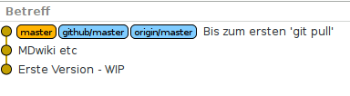

Cheat-Sheet
===========

Voraussetzungen
---------------

### 0800

Firefox installieren

```
$ sudo apt-get install firefox
```

### 0810

Git-Kommandozeilen-Tools installieren

```
$ sudo apt-get install git gitk
```

### 0890

Meld installieren

```
$ sudo apt-get install meld
```

### 0900

Gitg installieren

```
$ sudo apt-get install gitg
```

### 0910

Zwei lokale Clones - URL kommt von oben rechts!

```
$ git clone git@github.com:(deinFork)/git-pull-training.git f1-git-pull-training
$ git clone git@github.com:(deinFork)/git-pull-training.git f2-git-pull-training
```

Ablauf
------

### Vorbereitungen

#### 1010

Stelle sicher, dass alle Änderungen am zentralen Repo bei Dir lokal verfügbar sind!

```
$ git fetch --all -p
Fordere an von origin
```

#### 1020

Visualisiere die Situation

```
$ gitg master origin/master
```



### Durchführung

#### 1100

Fenster1: Lege neue Datei an

```
f1...$ echo >pull-training-neu.txt "Ich finde es gut!"
```

#### 1110

Fenster1: Speichere Datei lokal in GIT

```
f1...$ git add pull-training-neu.txt
f1...$ git commit -m "Neue Datei im ersten Fenster" .
```

#### 1120

Fenster2: Lege neue Datei an

```
f2...$ echo >pull-training-kollege.txt "Ich finde es supergut!"
```

#### 1130

Fenster2: Speichere die Datei lokal in GIT

```
f2...$ git add pull-training-kollege.txt
f2...$ git commit -m "Neue Datei im zweiten Fenster" .
```

#### 1140

Fenster2: Veröffentliche die Änderung

```
f2...$ git push
```

#### 1150

Fenster1: Lege noch neue Datei an

```
f1...$ echo >pull-training-nochmal.txt "Langsam wird's langweilig!"
```

#### 1160

Fenster1: Speichere Datei lokal in GIT

```
f1...$ git add pull-training-nochmal.txt
f1...$ git commit -m "Noch eine neue Datei im ersten Fenster" .
```


#### 1170

Fenster1: Veröffentliche die Änderungen

```
$ git push
```

<html>
<p></p>
<p></p>
<p></p>
<p></p>
<p></p>
<p></p>
<p></p>
<p></p>
<p></p>
<p></p>
<p></p>
<p></p>
<p></p>
<p></p>
<p></p>
<p></p>
<p></p>
<p></p>
<p></p>
<p></p>
<p></p>
<p></p>
<p></p>
<p></p>
<p></p>
<p></p>
<p></p>
<p></p>
<p></p>
<p></p>
<p></p>
<p></p>
<p></p>
<p></p>
<p></p>
<p></p>
<p></p>
<p></p>
<p></p>
<p></p>
<p></p>
<p></p>
<p></p>
<p></p>
</html>
